# Programming Custom LED Effects with Madri A User Friendly Guide
Welcome to the exciting world of LED effect customization! This comprehensive guide is designed to walk you through every step of the process, ensuring that even if you’re new to computers, you’ll be able to follow along and successfully create stunning LED effects.

---

## Before You Begin

Welcome to the exciting world of LED effect customization! This comprehensive guide is designed to walk you through every step of the process, ensuring that even if you’re new to computers, you’ll be able to follow along and successfully create stunning LED effects.
The main way to create and record effects is to use Madrix software. This is commercial software that requires a subscription, but the free version is enough for you to work. But unfortunately, after version 3, Madrix software no longer allows you to record effects without a license, so you will need to install Madrix 3 if you want to use it for free.

**If you have a license, then you will only need a program to record effects. However, make sure that your license gives you enough universes for your product.**

Madrix 3 runs on **Windows 10** (or earlier), and it is not supported on Mac OS or later versions of Windows. But if you don’t have this operating system, then don’t worry - we have prepared instructions for you to install a virtual machine that will already have all the necessary software to get started!

**Recommended PC specifications for running a virtual machine: - 8 GB of RAM - 32 GB of free disk space. If possible, put it on an SSD drive, because HDD performance is low for virtual machines (they will slow down).**

**Conclusion:**

* If you have Mac OS or Windows 11 and above, you will need a virtual machine to run Madrix 3. Proceed to the first step.

* If you have a license to work in Madrix, then you can use any version, but pay attention to the number of universes available in your license. Install effects recorder from step 2 and proceed to step 3.

* If you have an OS that supports Madrix 3, go to step 2.

*If you already have all the necessary software and you just want to create effects, proceed to step 3.

---

##  Step 1 – Setting Up a Virtual Machine 

<strong>VirtualBox (Windows / macOS)</strong>

**We have a prepared Windows 10 image for you and we recommend using it. If desired, you can build the virtual machine image that you want to use yourself, but do this only if you already know how to work with virtual machines.**

If you are a Windows user, then we have 2 options for you to install a virtual machine: 1) Using a third-party VirtualBox 2) Using the built-in Hyper-V
The difference is that Hyper-V is a virtualization system built into Windows, which works better than VirtualBox in this case. Therefore, we recommend this method, but it may seem more complicated to you. However, if you encounter any problems with it, then you can always return to the VirtualBox option.
If you are a **macOS** user, then only the method using VirtualBox is suitable for you.

**Important: the virtual machine may lag a lot when it is first started. In this case, after logging into the user’s account, let Windows work for a while so that it makes all the necessary changes. This can take from 20-30 minutes to 1-2 hours, depending on the performance of your system. Most often, slowdowns are caused by installing the system on the HDD. If possible, install the virtual machines on an SSD drive.**

**1. Installing VirtualBox**

Download [VirtualBox](https://www.virtualbox.org/wiki/Downloads) from the official website and install it on your PC. 

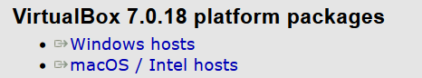

**2. Creating a virtual machine**

> The user’s password is “etereshop”

Steps:
1. Download the Windows.ova file (this is an archived virtual machine image)
2. Launch VirtualBox, click Import
3. Select the downloaded file Windows.ova
4. Select the appropriate settings and wait for the import to complete
   
We also have a video tutorial on installing and configuring this virtual machine.

<strong> An alternative way for Windows users: Hyper-V</strong>

** Enabling the Hyper-V component**
   
Hyper-V is a built-in component of Windows, i.e. you do not need to install any software to run a virtual machine, but you may need the Internet so that Windows can get the necessary files. To enable this component, you need to do the following: 
1. Search for Turn Windows features on or off
2. Check the Hyper-V component
3. Click OK, wait for the changes to be made and restart the computer

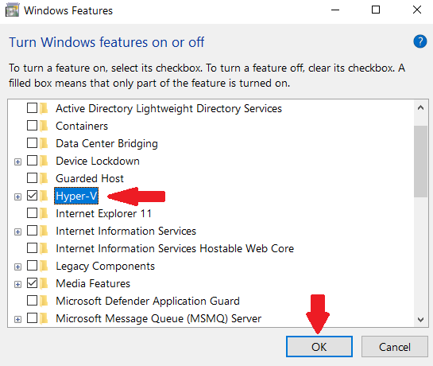

If you **do not see the Hyper-V** component in the list (most likely you are a Windows Home distribution user), then you can install it using a special file: hyperv.bat To do this, follow these steps: 1. Download the file 2. Run it as an administrator: select the file, right-click, select run as an administrator. 3. Wait for the installation to finish. 4. At the end, you will be prompted to restart your computer, you can type “y” or “n” **without quotes** and press enter. However, a reboot is necessary in any case to make changes.

After this step, the **Hyper-V** Manager application will appear on your system - with it you will be able to manage your virtual machines.

**Creating a virtual machine**

1. Download the [Madrix.vmcz](https://drive.google.com/file/d/1Oc9T0QdLcCz-ylFizRLqyfM9VQiR-m5G/view?pli=1) file (this is an archived virtual machine image)
2. Double-click on the downloaded file
3. Click “Import Virtual Machine”
4. Wait for the import to finish (It may take some time.)
5. You can run your virtual machine

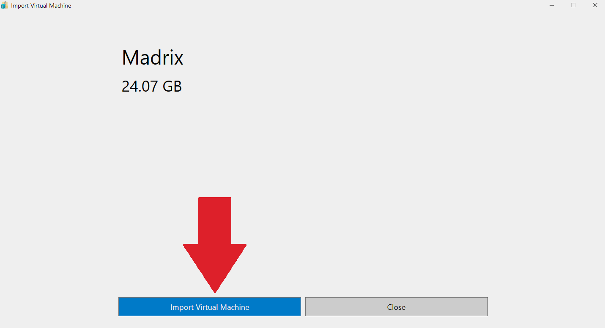

<strong>How to set up and launch</strong>

**How to set up**

First, you can change the installation paths of virtual machines if you have several disks and you do not want to install a virtual machine on the system disk (this is the default path). To do this, do the following:

1. Open Hyper-V Manager
2. Right-click on the name of your computer:

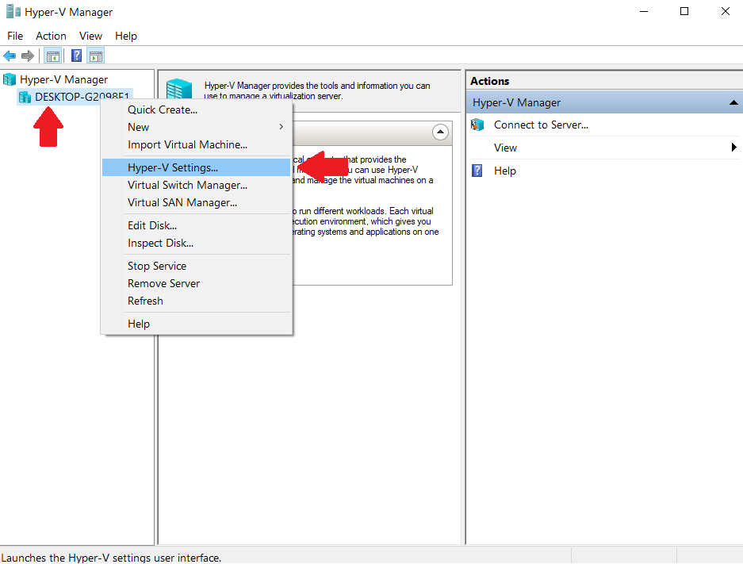

3. Select a location for storing virtual machine disks (you don’t need to change the other paths)

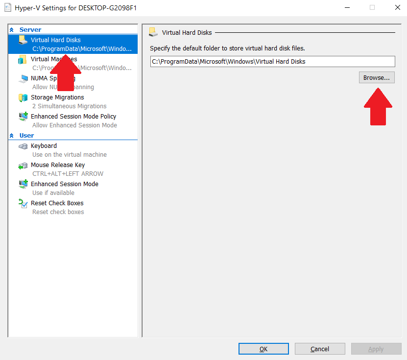

> Warning! Check the presence of this check mark in the Hyper-V Manager settings 

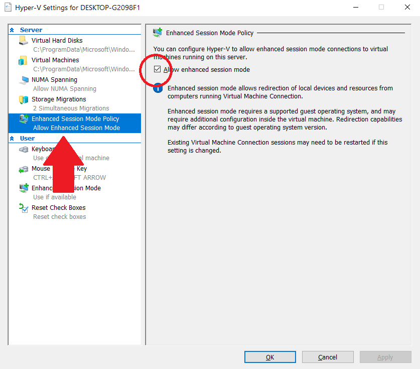

After importing the virtual machine, it will appear in the central window of the **Hyper-V** Manager program. To open this list, left-click on the name of your computer in the list on the left. The settings of the virtual machine are opened by right-clicking on it and clicking on the Settings item.

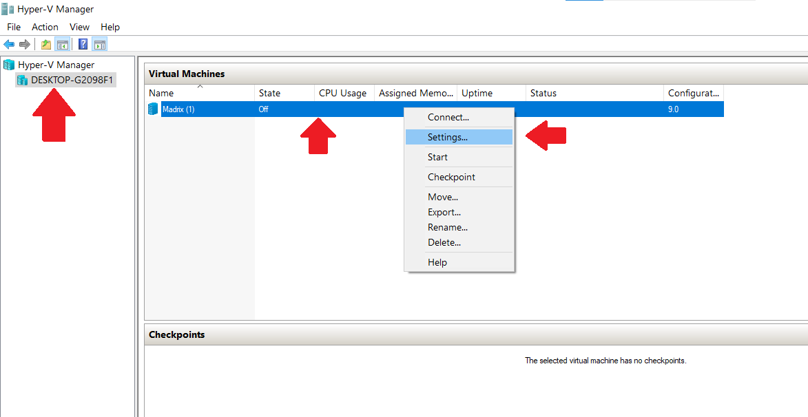

> You can change the settings of a virtual machine only when it is turned off

On the **Memory ta**b, you can configure the amount of RAM available for the virtual machine:

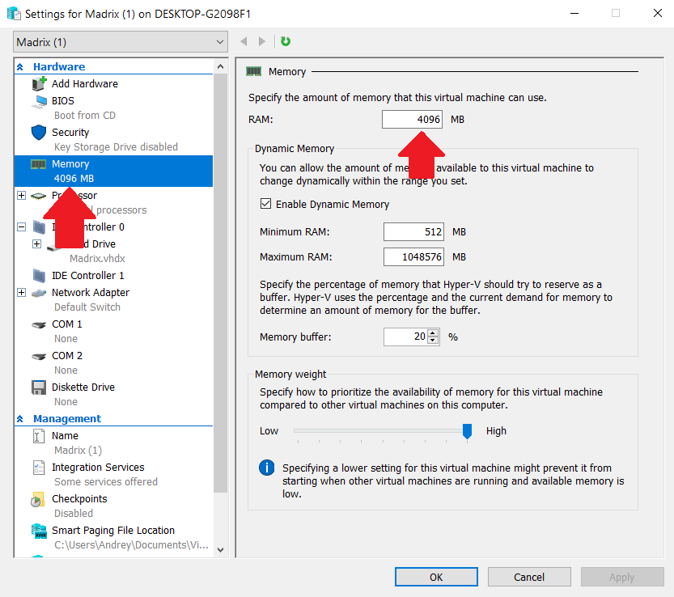

On the **Processor tab**, you can configure the number of available processor cores for a virtual machine

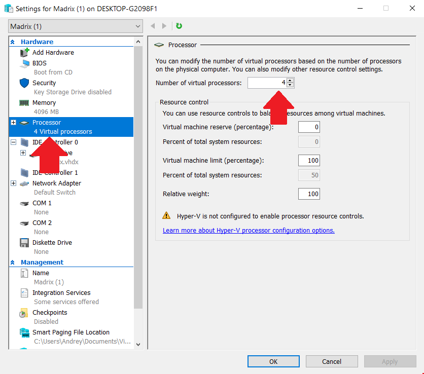

Check that the **Enable checkpoints** checkbox is disabled:

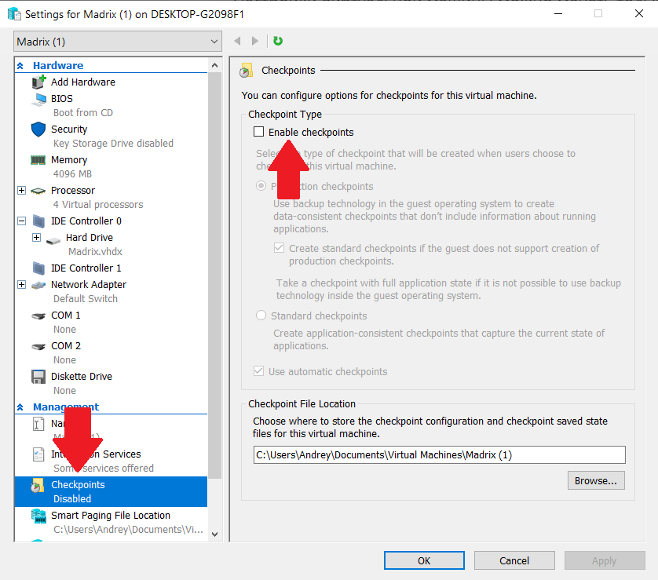

**How to launch**

Virtual machines start working in the background at startup. You can connect and disconnect to them, they will still continue to work. You can see the status of the virtual machine at the bottom of the application when you click on it:

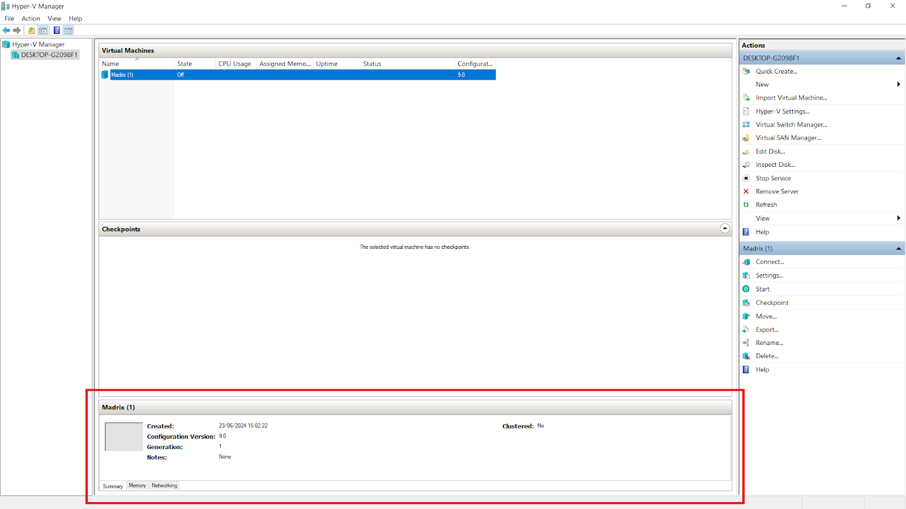

After the launch:

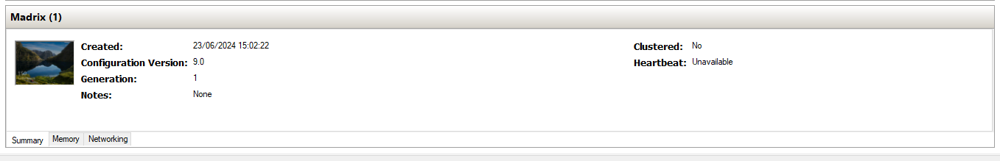

Therefore, you can start a virtual machine by clicking on it and selecting **Start**. Then you can right-click and select **Connect** - you will connect to the VM. If you close the window, you can connect to the machine again by clicking **Connect**. To stop a virtual machine, you can click Shutdown in the Start menu of the virtual Windows or by clicking on the virtual machine and selecting **Stop**.

When connecting to a VM, you will see the enhanced mode settings window. With this mode, the virtual machine can interact with your PC. Click **Show Options**:

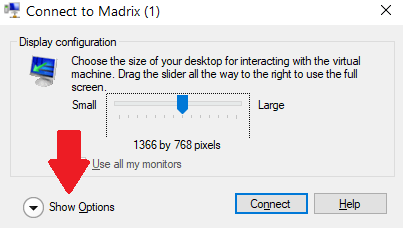

Select the **Local Resources tab**, expand the **Drives list**, and select which of your disks you want to connect to the VM. You can also select a USB flash drive if it is currently connected to a PC. Or you can choose the Drives that i plug in later option. The selected disks will appear in the explorer in the virtual machine. This way you can download the recorded effects directly to your computer/USB.

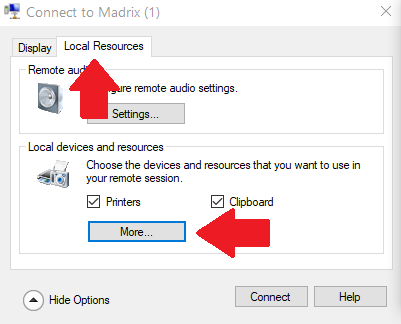

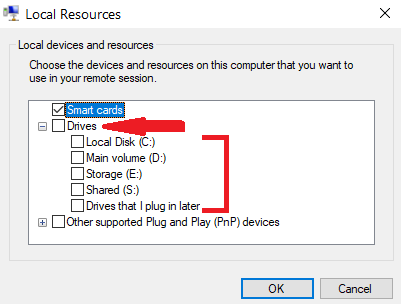

> Before clicking the Connect button, you can return to the Display tab and select Save my settings for future connections to this virtual machine

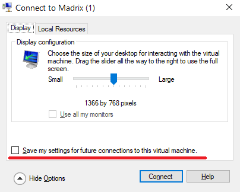

Now you can click the **Connect** button and start working in your virtual machine!

**Possible problems**
 1. If you have a small amount of RAM (8 GB or less), reduce the value of RAM available to the virtual machine (set 3072 or 2048). Just keep in mind that this will lead to a decrease in the performance of the virtual machine.
 2. If you encounter an error at startup about a lack of RAM, close background applications and/or reduce the available amount of RAM for the virtual machine.
 3. Virtual machines are resource-demanding, so it is not recommended to run them together with other “heavy” programs (browsers, various editors, etc.). 

If you have installed our virtual machine, then congratulations - you can already start creating effects! Proceed to the third step
   

---

##  Step 2 – Installing the Necessary Software 

<strong>Drivers & Tools</strong>

**If you have installed our virtual machine, then you can skip this section.**
You need to install the following components:
1) Necessary drivers
2) Madrix 3
3) Effects recorder

>Warning! Madrix 3 can only be installed on Windows 10 (or earlier). If you are a user of another OS, read the first section “Before You Begin”.

We also have a [Video Tutorial](https://www.youtube.com/watch?v=dO-x0v_YKjU) on installing the above software.

### Installing drivers

**Microsoft Visual C++ 2013:**

There are two versions of this – x64 and x86. Modern computers are mostly x64 but if you’d like to check this which version you need, follow these steps:
1) Press the “Windows” key (the one with the Windows logo) and the “R” key at the same time. This will open the “Run” dialog.
2) Type in “msinfo32” (without the quotes) and hit Enter.
3) Look for the “System Type” entry. It will tell you whether you have a 32-bit (x86) or 64-bit (x64) operating system.
4) Once you know your system type, click on the appropriate link to download Microsoft Visual C++ 2013.

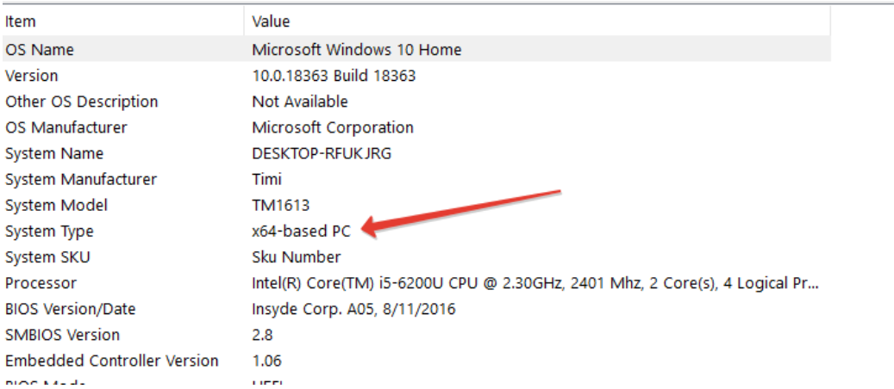

**WinPcap:**

Click [the link](https://drive.google.com/file/d/1WowHznKa8C4XwzJzDmBd8SqC2-SewEcm/view) to download this driver. It helps with network traffic monitoring, which is essential for our LED effects.

> Warning! You may have another version of this driver on your system - npcap. The recording program is incompatible with it, so you first need to delete it, and only then install WinPcap. You can check the availability of this driver in the list of applications (write Apps in the search).

### Installation of Madrix 3

This is the main software that we will use. Click [the link](https://drive.google.com/file/d/1oNsEQdwLwEwgVo3F3SliWus57USQjZi2/view) to download it. After downloading, follow the installation instructions in this application to set it up on your computer.

### Installing Effects recorder

> Warning! The WinPcap driver is required for this program to work. If you did not install it, then refer to the Installing drivers section of this step.

Finally, you need the [Effects recorder](https://drive.google.com/file/d/1ygfa-5wGs9umWlRsgPtMwBt47tdS5j7A/view). This software helps us capture and record the LED effects we create. After downloading, just unzip this archive and the application will be ready to work. You can place it in any place convenient for you, as well as make a shortcut for quick access (via the right-click context menu).

> The Effects Recorder is compatible exclusively with Madrix version 3.x or any Madrix version equipped with a valid license key. If you do not intend to purchase a license key, decline any upgrade offers to version 5.x when you initially launch the software. In most scenarios, a Trial version of Madrix 3 suffices for Etereshop’s controller, as the controller continuously loops effects. For instance, you can run a 15-second effect for 1-2 hours with this setup. Madrix serves as the platform for creating effects, while the Effects Recorder is employed to capture these effects from Madrix and convert them into .txt format files. These files can then be easily uploaded onto the SD card for your convenience.

---

##  Step 3 – Importing and Creating LED Effects

<strong>Open Your Project File</strong>

Great job on completing the previous steps! Now it’s time to roll up our sleeves and start creating those fantastic LED effects.

You should have received an email from us after completing your order. This email typically has a link to a cloud drive with Madrix project file together with backup files for your product. The MSZ file is crucial for customizing your LED effects, so make sure you find it. If you can’t locate it, don’t worry – just contact us at sales@etereshop.com, and we’ll help you out.

Once you have the Madrix project file, simply double-click on it to open it. If that doesn’t work, you can also open Madrix, click on “File” in the top left corner, and then choose “Open Setup.” Alternatively, press “Ctrl” and “O” on your keyboard at the same time.

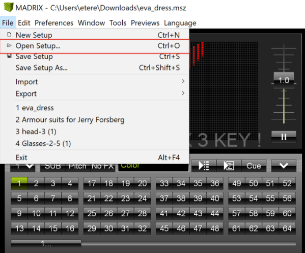

<strong>Effect Library & Templates</strong>

### Access the Effect Library

Our Effects Library is your creative playground. You’ll find a collection of effect samples that you can use and customize. To make things even easier, we’ve prepared short videos to guide you through the process.

* [Download the Library](https://drive.google.com/open?id=1n6zfrZB7e-kuGIrPIW2Oox5tQg4fkwhc)  
* [Watch tutorial](https://www.youtube.com/watch?v=fwkRx998_QM)  

> Warning! If you want to open a new project after working in the previous one, it is better to completely close Madrix first in order to avoid bugs with the project settings!

Take a moment to watch the videos in the library. These short tutorials will help you navigate through the process of working with the effect samples. Don’t worry – we’re here to make sure you’re comfortable every step of the way.

<strong>Make Your Own Effects</strong>

### Start Creating Your Own Effects

If you’re feeling confident, you can dive into creating your very own LED effects! We have a quick guide here to help you get started. This guide is presented in Russian with English subtitles, so you can follow along easily.

[Watch tutorial:](https://www.youtube.com/watch?v=D7ihn3LcXHc)

### Adding Text to Effects

Want to add text to your LED effects? We’ve got you covered! Check out this guide on how to add text to existing effects. It’s presented in both Russian and English subtitles, ensuring that you won’t miss a beat
 
[Watch tutorial:](https://www.youtube.com/watch?v=D7ihn3LcXHc)  

### 3D Effects for Extra Flair

For a touch of advanced creativity, explore 3D effects using Madrix. Even though the tutorial focuses on a 3D cube, the techniques can be applied to various products. Watch the tutorial here with English subtitles.

[Watch tutorial:](https://www.youtube.com/watch?v=fwkRx998_QM)

---

##  Step 4 – Recording Your Effects 

Congratulations on your progress! Now, let’s move on to recording the LED effects you’ve created.

<strong>Use Effects Recorder</strong>

Remember that Effects Recorder we set up earlier? It’s time to put it to work. Follow this recording tutorial to capture your LED effects. This tutorial shows you exactly how to operate the recorder step by step.

[Watch tutorial](https://www.youtube.com/watch?v=ZZECUX7TrQk)

<strong>Selecting the Right Device</strong>

In the tutorial, you’ll see how to choose a device from a dropdown list in the recorder. Once you see the parameter “Artnet” starting to increase, that’s the device you want to use for recording.

> If you’re using the trial version of Madrix, remember that you can only record effects up to 1 minute in length due to blackouts. Just stop recording before the screen goes black and restart recording when it gets back on.

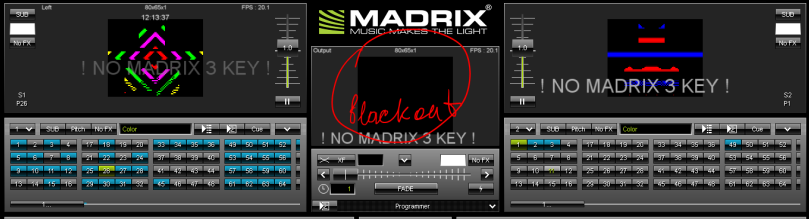

Follow these steps to record your effects: 
1. Open **VS_PcapSniffer** and select a device from the dropdown list.
2. Click the “Start recording” button.
3. If the status displays as Artnet:0, total:0, press “Stop recording,” choose a different device, and try again. Once the Artnet parameter starts increasing, remember that this is the device you should consistently choose for recording. With this setup, you’re all set to commence recording your effects.

---

##  Step 5 – Copying Effects to the Controller’s SD Card 

<strong>File Transfer Process</strong>

> Warning! If you are currently using the product, you must first turn it off. After that, disconnect the controller from the power source (batteries). This prevents damage to the memory card. Now you can get the SD card. After you save all the necessary files on it, insert it back and only then turn on the product again.

On the micro-SD card, you’ll find “old” effects. You can remove them by deleting or creating a new folder and moving there. If you plan to use them later, you can even move the files to your computer. The final step is to copy and paste your newly recorded effects to the SD card. Once that’s done, insert the SD card back into the controller.

>The structure of the files on the sd card:
>1) File config.txt - the configuration file of your product
>2) Effects files. They should have the following name format: S{sequence number}.txt For example: S1.txt , S2.txt , S5.txt , S70.txt The numbering does not have to be sequential. The number can optionally be >followed by a name if the effect is somehow special. For example: S12_logo.txt , S4_text.txt
>3) You can create folders and put other files there - they will not be perceived by the controller

If for some reason you have problems with the SD card, you can format it and copy the files that were sent to you by email with the purchase of the product.

### You’re Ready to Shine!

Congratulations! You’ve successfully customized your LED effects using Madrix. Your hard work and creativity will now light up the world around you. Remember, if you ever encounter any difficulties or have questions along the way, feel free to reach out to us at sales@etereshop.com. We’re here to help and support you in your LED programming journey. Happy programming!

### Final Notes

You’ve completed the journey of installing and customizing LED effects using Madrix, whether on a physical Windows PC or a virtual machine. if you encounter any challenges or have questions. We’re here to make your LED programming experience a success!

---

##  Common problems 

<strong>Problems and solutions</strong>

### My recorded effect flickers with random colors and/or freezes

Most likely, you have the wrong version of the WinPcap driver. Go to the “Installing drivers” item in step 2. It describes the solution to this problem.

### My effect partially works, but some of it is still broken

Make sure that you are using the Madrix project specifically for your product. Designs from some products cannot be used to record effects on other products, so do not confuse them.

Also make sure that the product’s SD card contains exactly its file config.txt

If you use the purchased Madrix license, then make sure that the number of universes available in it is sufficient for your product. The number of universes of the product can be viewed on the DMX Devices tab, which can be opened by pressing the F4 button in the Madrix or by clicking on Preferences -> Device Manager.

### I get the “Too long delay” message when recording the effect

You are most likely connected to a wireless network. These networks are not stable and reliable. You can try to make multiple recording attempts or record a shorter effect, but it’s best to connect to the network by wire.

### The value of Artnet is not increased on any of the sources

You may have forgotten to enable ArtNet support in Madrix. To enable it, open the Device Manager window (by pressing F4 or using Preferences -> Device Manager). Go to the Art-Net tab and check the appropriate check mark

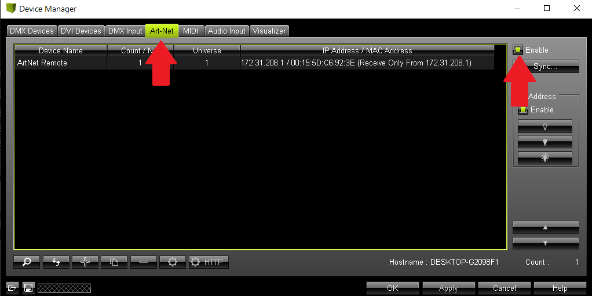

### The configuration of Art-Net in Madrix is incorrect

If you have opened a new madrix project without closing the previous one, then it is highly likely that their configurations will mix due to a madrix bug. Before opening a new project, first completely close the Madrix

### The network config breaks down in Madrix (extra entries appear)

If you want to open a new project after working in the previous one, it is better to completely close Madrix first in order to avoid bugs with the project settings.

### Files on the SD card are duplicated

This problem happens due to incorrect extraction of the sd card. How to do it right: If you are currently using the product, you must first turn it off. After that, disconnect the controller from the power source (batteries). This prevents damage to the memory card. Now you can get the SD card. After you save all the necessary files on it, insert it back and only then turn on the product again.

---

